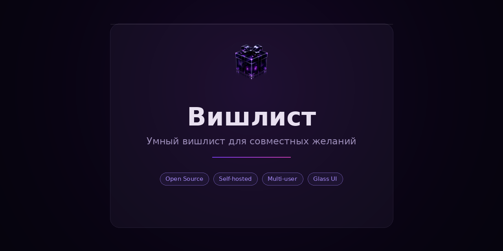
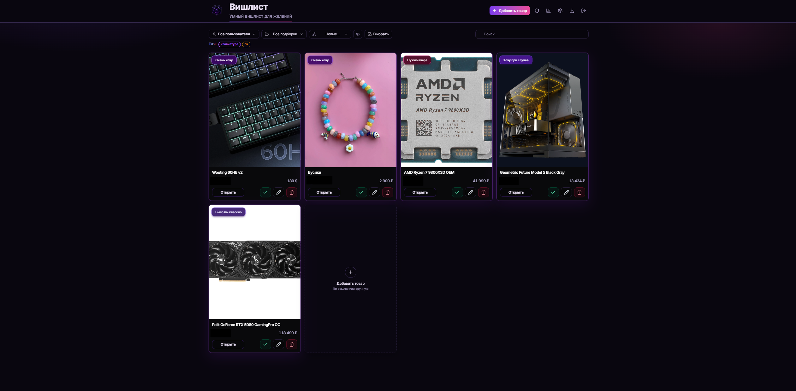
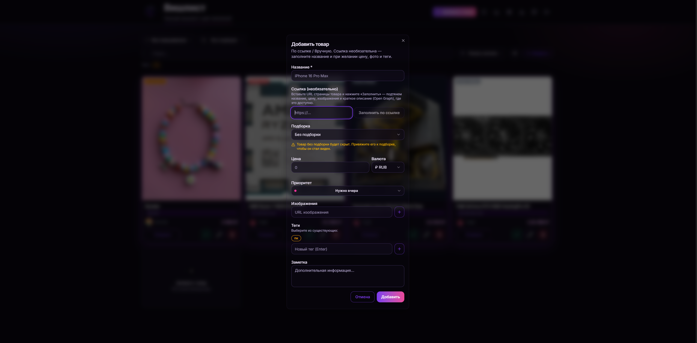

# Wishlist App

<p align="center">
  
</p>

Простое и красивое приложение для личных, семейных и дружеских вишлистов. Добавляйте желания, делитесь подборками, бронируйте подарки без неловких дублей и пользуйтесь Telegram-ботом для быстрых действий.

## ✨ Что умеет

- 🎁 Создавать личные и общие вишлисты
- 👨‍👩‍👧‍👦 Открывать доступ семье и друзьям
- ✅ Бронировать и отмечать купленные подарки
- 🔗 Добавлять товары вручную или по ссылке
- 🏷️ Использовать теги, приоритеты, цены и заметки
- 🔎 Искать, фильтровать и сортировать подарки
- 🤖 Подключать Telegram-бота для быстрых действий и уведомлений
- 📱 Устанавливать приложение на телефон как PWA
- 📤 Экспортировать данные в `CSV` и `JSON`

## 🖼 Скриншоты

<p align="center">
  
</p>

<p align="center"><em>Главный экран: карточки, поиск, фильтры и быстрые действия</em></p>

<p align="center">
  
</p>

<p align="center"><em>Добавление подарка вручную или по ссылке</em></p>

## 🚀 Запуск за пару минут

README ориентирован на самый простой сценарий: запуск через Docker Compose.

### 1. Что понадобится

- Docker
- Docker Compose
- доступ к терминалу на сервере или локальной машине

### 2. Склонируйте проект

```bash
git clone https://github.com/Superior-Kqller/wishlist-app.git
cd wishlist-app
```

### 3. Подготовьте `.env`

```bash
cp .env.example .env
```

Минимум, который нужно заполнить:

- `DB_PASSWORD` — пароль PostgreSQL
- `NEXTAUTH_SECRET` — секрет приложения
- `NEXTAUTH_URL` — адрес, по которому будет открываться сайт
- `SEED_USER1_*` и `SEED_USER2_*` — стартовые пользователи

Пример:

```env
DB_PASSWORD=super-strong-password
NEXTAUTH_SECRET=generate-with-openssl-rand-base64-32
NEXTAUTH_URL=https://wishlist.example.com
APP_PORT=4030

SEED_USER1_USERNAME=user1
SEED_USER1_PASSWORD=strong-password-1
SEED_USER1_NAME=User One

SEED_USER2_USERNAME=user2
SEED_USER2_PASSWORD=strong-password-2
SEED_USER2_NAME=User Two
```

### 4. Создайте сеть для reverse proxy

```bash
docker network create proxy
```

Если сеть уже существует, Docker просто сообщит об этом.

### 5. Запустите приложение

```bash
docker compose -f docker-compose.prod.yml pull
docker compose -f docker-compose.prod.yml up -d
```

По умолчанию приложение публикуется на `127.0.0.1:${APP_PORT}`. Если `APP_PORT=4030`, адрес будет таким:

```text
http://127.0.0.1:4030
```

### 6. Проверьте, что всё поднялось

```bash
docker compose -f docker-compose.prod.yml ps
docker compose -f docker-compose.prod.yml logs -f wishlist-app
```

## 🧭 Что делать после первого входа

1. Войдите под одним из стартовых пользователей из `.env`.
2. Создайте первую подборку подарков.
3. Добавьте несколько карточек вручную или по ссылке.
4. Откройте доступ близким или друзьям.
5. При желании подключите Telegram-бота.
6. На телефоне установите сайт как приложение.

## 🤖 Telegram-бот

Telegram в этом проекте нужен для быстрых действий и уведомлений.

Что уже есть:

- просмотр своих подарков
- просмотр доступных подарков
- действия со статусами через бота
- уведомления о брони и покупке

Как подключить:

1. Создайте бота через BotFather.
2. Получите `Telegram ID` своего аккаунта.
3. Добавьте в `.env`:

```env
TELEGRAM_BOT_TOKEN=123456789:AA...
TELEGRAM_WEBHOOK_SECRET=your-secret
```

`TELEGRAM_WEBHOOK_SECRET` может быть любой длинной случайной строкой. Например, в PowerShell её можно сгенерировать так:

```powershell
[guid]::NewGuid().ToString('N') + [guid]::NewGuid().ToString('N')
```

4. Перезапустите приложение после изменения `.env`.
5. Укажите свой `Telegram ID` на странице настроек аккаунта.
6. Установите webhook на ваш публичный домен:

```powershell
Invoke-RestMethod `
  -Method Post `
  -Uri "https://api.telegram.org/bot<TELEGRAM_BOT_TOKEN>/setWebhook" `
  -ContentType "application/x-www-form-urlencoded" `
  -Body @{
    url = "https://your-domain.com/api/integrations/telegram/webhook"
    secret_token = "<TELEGRAM_WEBHOOK_SECRET>"
  }
```

Webhook должен указывать на:

```text
https://your-domain.com/api/integrations/telegram/webhook
```

7. Проверьте, что webhook действительно установлен:

```powershell
Invoke-RestMethod `
  -Uri "https://api.telegram.org/bot<TELEGRAM_BOT_TOKEN>/getWebhookInfo"
```

Если всё настроено правильно, в ответе поле `url` не будет пустым.

8. Откройте бота и отправьте `/start` для подтверждения привязки.

Telegram должен передавать `secret_token`, равный `TELEGRAM_WEBHOOK_SECRET`. Если `url` пустой, бот не сможет доставлять `/start` и кнопки в ваше приложение.

### Если webhook нужно переустановить

Сначала удалите старый:

```powershell
Invoke-RestMethod `
  -Method Post `
  -Uri "https://api.telegram.org/bot<TELEGRAM_BOT_TOKEN>/deleteWebhook"
```

Потом снова выполните `setWebhook`.

### Важно

- Сайт должен быть доступен из интернета. `localhost` для Telegram не подходит.
- Если токен бота случайно попал в чужие руки, перевыпустите его через BotFather.
- Без webhook бот не сможет обработать `/start`, inline-кнопки и другие входящие действия.

## 📱 Установка на телефон

Приложение поддерживает PWA и может работать почти как нативное:

- на iPhone/iPad: откройте сайт в Safari и выберите `На экран Домой`
- на Android: откройте сайт в Chrome и выберите `Установить приложение`

Это удобно, если хотите быстрый доступ к вишлисту без отдельного стора.

## ❓ FAQ

### Где хранятся данные?

Основные данные лежат в Docker volume `postgres-data`. Загруженные файлы и картинки хранятся в `uploads-data`.

### Как проверить, что приложение живо?

Откройте:

- `/api/health` — состояние приложения и БД
- `/api/version` — текущая версия

### Как обновить приложение?

Обычно достаточно:

```bash
docker compose -f docker-compose.prod.yml pull
docker compose -f docker-compose.prod.yml up -d
```

Если в новой версии есть миграции, контейнер применит их при старте.

### Telegram не отвечает. Что проверить?

- задан ли `TELEGRAM_BOT_TOKEN`
- задан ли `TELEGRAM_WEBHOOK_SECRET`
- установлен ли webhook на правильный URL
- совпадает ли `secret_token`
- подтвердил ли пользователь привязку через `/start`

### Можно ли использовать без Telegram?

Да. Telegram-интеграция полностью опциональна.

## 🛠 Коротко для self-host

- Основной сценарий запуска: `docker-compose.prod.yml`
- База данных: `PostgreSQL 17`
- Кэш / rate limit: `Valkey` с fallback на in-memory
- Версия приложения доступна через `/api/version`
- История изменений: [CHANGELOG.md](CHANGELOG.md)
- Docker-образ: `ghcr.io/superior-kqller/wishlist-app:latest`

## 📄 Лицензия

[LICENSE](LICENSE)
