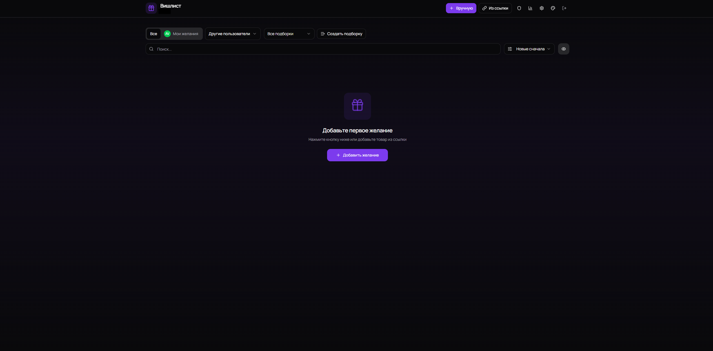

# Wishlist App

Современное приложение для создания и управления списками желаний.

## Скриншоты

<p align="center">
  
</p>

## Стек (кратко)

- **Приложение:** Next.js 16 (App Router)
- **База данных:** PostgreSQL 17 + Prisma
- **UI:** Tailwind CSS + shadcn/ui + Framer Motion
- **Аутентификация:** NextAuth.js с ролями (USER/ADMIN)
- **Инфраструктура:** Docker + Docker Compose

## Основные возможности

- 🔐 Безопасная аутентификация с ролями (USER/ADMIN)
- 👥 Управление пользователями (создание, редактирование, удаление)
- 🔑 Смена пароля и профиля
- 🎯 Приоритеты (1-5 звезд)
- 🏷️ Теги с фильтрацией
- 🔍 Поиск и сортировка
- 🛒 Отметка "куплено"
- 🎨 7 цветовых тем + светлая/тёмная/системная
- 📱 Адаптивный дизайн
- 🚀 Пагинация для больших списков
  (rate limiting, CSP, валидация и др. — под капотом, без лишних настроек)

## Быстрый старт (Деплой на Ubuntu VM)

### 1. Подготовить директорию

```bash
mkdir -p /opt/wishlist && cd /opt/wishlist
```

### 2. Скачать docker-compose и .env.example

```bash
curl -fsSL https://raw.githubusercontent.com/Superior-Kqller/wishlist-app/main/docker-compose.prod.yml -o docker-compose.yml
curl -fsSL https://raw.githubusercontent.com/Superior-Kqller/wishlist-app/main/.env.example -o .env.example
```

### 3. Создать proxy network (если ещё не создана)

```bash
docker network create proxy
```

### 4. Настроить окружение

Создать `.env` из шаблона и сразу подставить случайные значения (Ubuntu/Linux, одной командой):

```bash
cp .env.example .env && DB_PASSWORD="$(openssl rand -hex 32)" && NEXTAUTH_SECRET="$(openssl rand -base64 32)" && sed -i "s/^DB_PASSWORD=.*/DB_PASSWORD=${DB_PASSWORD}/" .env && sed -i "s/^NEXTAUTH_SECRET=.*/NEXTAUTH_SECRET=${NEXTAUTH_SECRET}/" .env
```

После этого отредактируйте `.env` любым удобным редактором и убедитесь, что заданы:

- `DB_PASSWORD` — пароль для PostgreSQL
- `NEXTAUTH_SECRET` — секрет NextAuth
- `NEXTAUTH_URL` — URL вашего приложения (`https://wishlist.yourdomain.com`)
- `SEED_USER*` — логины, пароли и имена пользователей

### 5. Запустить приложение

```bash
docker compose pull
docker compose up -d
```

Проверить статус:

```bash
docker compose ps
docker compose logs -f wishlist-app
```

### 6. Создать пользователей (автоматически)

Пользователи создаются автоматически при первом запуске контейнера.
Логины и пароли берутся из `.env` файла (переменные `SEED_USER*`).

**Важно:** Первый пользователь автоматически получает роль ADMIN. Если админов нет, seed скрипт автоматически повысит первого пользователя до админа.

При необходимости можно пересоздать вручную:

```bash
docker compose exec wishlist-app node prisma/seed.js
```

Или повысить существующего пользователя до админа:

```bash
docker compose exec wishlist-app node prisma/promote-admin.js
```

Готово! Приложение доступно на порту `4030`. Настройте reverse proxy (Nginx, Caddy, NPM) по необходимости.

## Локальная разработка

### Требования

- Node.js 22+
- PostgreSQL 17+
- npm или pnpm

### Установка

```bash
# Установить зависимости
npm install

# Настроить .env
cp .env.example .env
# Отредактировать DATABASE_URL

# Применить схему БД
npx prisma db push

# Создать пользователей
npm run db:seed

# Запустить dev сервер
npm run dev
```

Приложение доступно на `http://localhost:4030`

## Статус парсера маркетплейсов

В ранних версиях приложения использовался парсер карточек товаров с маркетплейсов (Wildberries, Ozon, AliExpress).

Сейчас эта функциональность нестабильна из‑за частых изменений сайтов и **не считается частью официального функционала**. В релизах 1.x парсер может быть частично отключён или работать только для отдельных кейсов.

Основной сценарий использования приложения — ручное добавление ссылок и товаров.

## Changelog и релизы

- История изменений: `CHANGELOG.md`
- Стабильные релизы и теги: раздел Releases в GitHub‑репозитории

## Лицензия

MIT

## Автор

Superior-Kqller

Проект создан с помощью AI (Claude / Cursor IDE).
