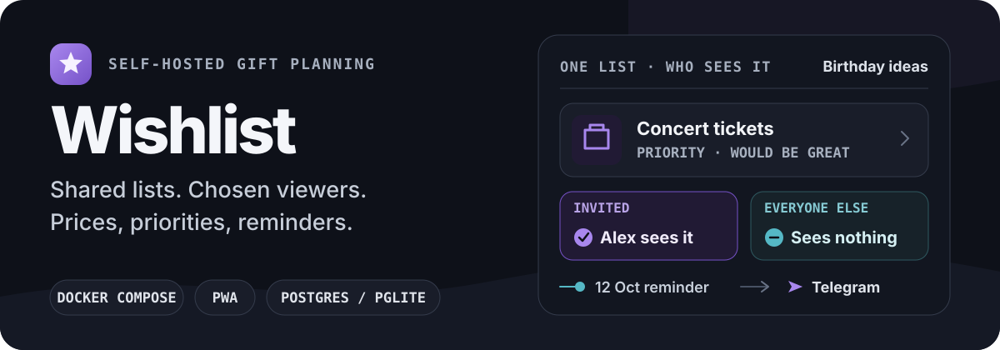
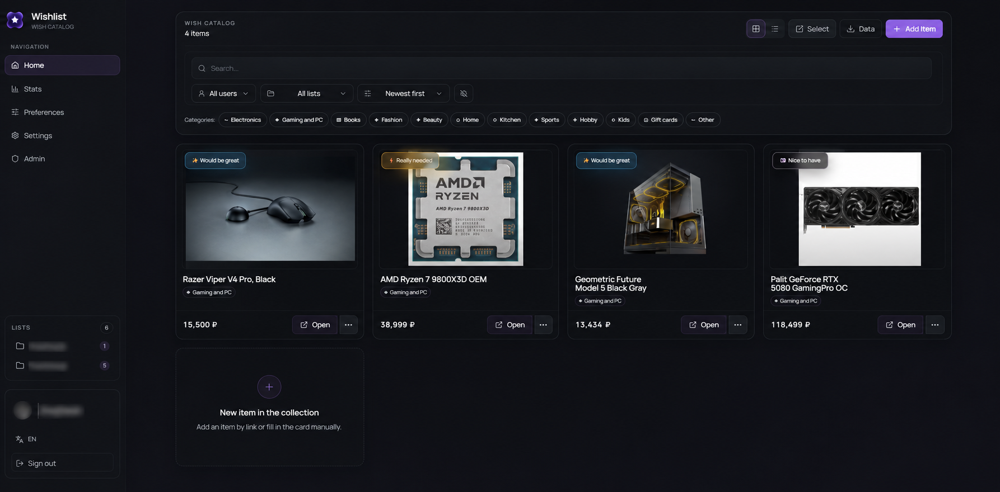

<p align="right">
  <a href="./README.ru.md">Русская версия</a>
</p>

<p align="center">
  
</p>

Wishlist is a self-hosted web app for families, friends, and small teams. It keeps wish ideas, preferences, important dates, and gift coordination in one place—without turning the group chat into a planning database.

<p align="center">
  
</p>

## One place for the whole gift loop

- **Collect ideas** — create personal or shared lists with product links, photos, prices, notes, categories, and priorities.
- **Choose without spoilers** — reserve a wish privately so other gift-givers avoid duplicates while the list owner keeps the surprise.
- **Plan around people** — use preferences, birthdays, personal dates, shared holidays, and automatic reminders to decide what matters and when.
- **Stay in sync** — track available and purchased items, comment on activity, export data, and optionally receive Telegram notifications.

The interface supports card and table views, search, filters, sorting, roles, an admin area, English and Russian, and installation as a mobile PWA.

## Run it your way

| Mode | Best for | Database |
| --- | --- | --- |
| **Docker Compose** | A regular long-running installation | PostgreSQL in its own container |
| **Single container** | A compact personal or home deployment | Embedded PGlite volume |
| **Development** | Local feature work and testing | Local PostgreSQL |

Valkey/Redis is optional. Without it, rate limiting falls back to the application process memory.

## Quick start

Requirements: Docker and Docker Compose.

```bash
git clone https://github.com/Superior-Kqller/wishlist-app.git
cd wishlist-app
cp .env.example .env
openssl rand -base64 32
```

Set strong values for `DB_PASSWORD`, `NEXTAUTH_SECRET`, and `NEXTAUTH_URL` in `.env`, then start the PostgreSQL deployment:

```bash
docker network create proxy
docker compose -f docker-compose.prod.yml pull
docker compose -f docker-compose.prod.yml up -d
```

Open `http://127.0.0.1:4030`.

For a single-container PGlite installation:

```bash
docker compose -f docker-compose.pglite.yml pull
docker compose -f docker-compose.pglite.yml up -d
```

PGlite does not need `DB_PASSWORD`; its files live in the `pglite-data` Docker volume.

All required and optional settings—including Telegram, reverse proxy, seed users, and Valkey—are documented in [`.env.example`](./.env.example).

<details>
<summary><strong>Add shared Valkey/Redis rate limiting</strong></summary>

```bash
docker compose \
  -f docker-compose.prod.yml \
  -f docker-compose.valkey.yml \
  up -d
```

</details>

## Calendar reminders

The production container processes reminders automatically; no cron job or external calendar service is required. Delivered checkpoints are persisted, so repeated processing does not duplicate notifications.

An administrator can choose the installation IANA time zone under **Administration → Calendar reminders**. The default is `Europe/Moscow`.

## Operations

The app exposes `/api/health` and `/api/version`. PostgreSQL data and uploaded images are stored in Docker volumes.

<details>
<summary><strong>Common Docker commands</strong></summary>

```bash
docker compose -f docker-compose.prod.yml ps
docker compose -f docker-compose.prod.yml logs -f wishlist-app
docker compose -f docker-compose.prod.yml pull
docker compose -f docker-compose.prod.yml up -d
```

For PGlite, replace `docker-compose.prod.yml` with `docker-compose.pglite.yml`.

</details>

## Local development

Requirements: Node.js 22, npm, and PostgreSQL.

```bash
npm ci
cp .env.example .env
npx prisma migrate deploy
npm run db:seed
npm run dev
```

Use a local `DATABASE_URL`, set `NEXTAUTH_URL=http://localhost:3000`, and add `DISABLE_PWA=1` to `.env`.

To start only the local database:

```bash
docker compose -f docker-compose.dev.yml up -d
```

Add `--profile cache` and set `REDIS_URL=redis://localhost:6379` when local Valkey is useful.

<details>
<summary><strong>Development commands</strong></summary>

| Command | Description |
| --- | --- |
| `npm run dev` | Start the development server |
| `npm run build` | Build the production app |
| `npm start` | Start the built app |
| `npm run lint` | Run ESLint |
| `npm test` | Run unit tests |
| `npm run test:e2e` | Run Playwright end-to-end tests |
| `npm run db:seed` | Create initial users |
| `npm run db:studio` | Open Prisma Studio |

</details>

## Stack

Next.js · React · TypeScript · Prisma · PostgreSQL / PGlite · NextAuth · Tailwind CSS · Radix UI · Docker Compose · optional Valkey/Redis

See [CHANGELOG.md](./CHANGELOG.md) for release history.

## License

[MIT](./LICENSE)
