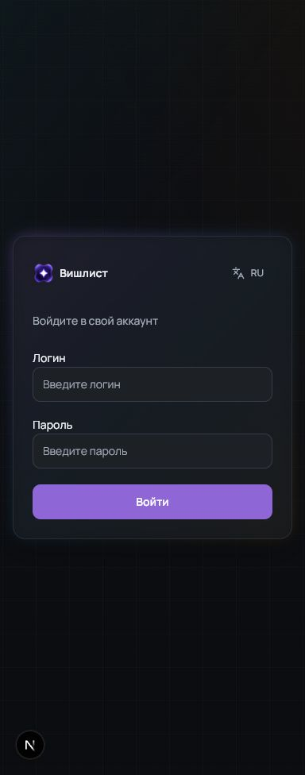

[Русская версия](README.ru.md)

<p align="center">
  
</p>

<h1 align="center">Wishlist App</h1>

A self-hosted wishlist app for families, friends, and small teams. Add gift ideas with photos and prices, share lists, reserve items, track purchases, and keep gift planning out of chats.

<p align="center">
  
</p>

<p align="center">
  
</p>

## Features

- Personal and shared wishlists
- Gift reservation to avoid duplicate purchases
- Item statuses: available, claimed, purchased
- Product photos, links, notes, tags, priorities, and prices
- Search, filters, sorting, card view, and table view
- User roles, admin panel, CSV/JSON export, and mobile PWA support
- Optional Telegram notifications and bot commands

## Stack

Next.js, React, TypeScript, Prisma, PostgreSQL, NextAuth, Tailwind CSS, Radix UI, Valkey/Redis, Docker Compose.

## Quick Start

Requirements: Docker and Docker Compose.

```bash
git clone https://github.com/Superior-Kqller/wishlist-app.git
cd wishlist-app
cp .env.example .env
```

Edit `.env`: set strong passwords, `NEXTAUTH_SECRET`, and `NEXTAUTH_URL`. Optional integrations are documented and commented in [.env.example](.env.example).

```bash
openssl rand -base64 32
docker network create proxy
docker compose -f docker-compose.prod.yml pull
docker compose -f docker-compose.prod.yml up -d
```

Open `http://127.0.0.1:4030`.

## Local Development

Requirements: Node.js 22, npm, and PostgreSQL.

```bash
npm ci
cp .env.example .env
npx prisma migrate deploy
npm run db:seed
npm run dev
```

For local development, use a local `DATABASE_URL`, `NEXTAUTH_URL=http://localhost:3000`, and `DISABLE_PWA=1` in `.env`.

## Configuration

All required and optional environment variables live in [.env.example](.env.example). Optional values are commented out there so a minimal install stays small.

Common production values:

- `DB_PASSWORD`
- `NEXTAUTH_SECRET`
- `NEXTAUTH_URL`
- `APP_PORT`
- `SEED_USER1_*` and `SEED_USER2_*`

## Operations

Useful commands:

```bash
docker compose -f docker-compose.prod.yml ps
docker compose -f docker-compose.prod.yml logs -f wishlist-app
docker compose -f docker-compose.prod.yml pull
docker compose -f docker-compose.prod.yml up -d
```

The app exposes `/api/health` and `/api/version`. PostgreSQL data, uploaded images, and Valkey socket data are stored in Docker volumes.

## Development Commands

| Command | Description |
| --- | --- |
| `npm run dev` | Start the dev server. |
| `npm run build` | Build the production app. |
| `npm start` | Start the built app. |
| `npm run lint` | Run ESLint. |
| `npm test` | Run unit tests. |
| `npm run test:e2e` | Run Playwright e2e tests. |
| `npm run db:seed` | Create initial users. |
| `npm run db:studio` | Open Prisma Studio. |

Release history: [CHANGELOG.md](CHANGELOG.md).

## License

[LICENSE](LICENSE)
