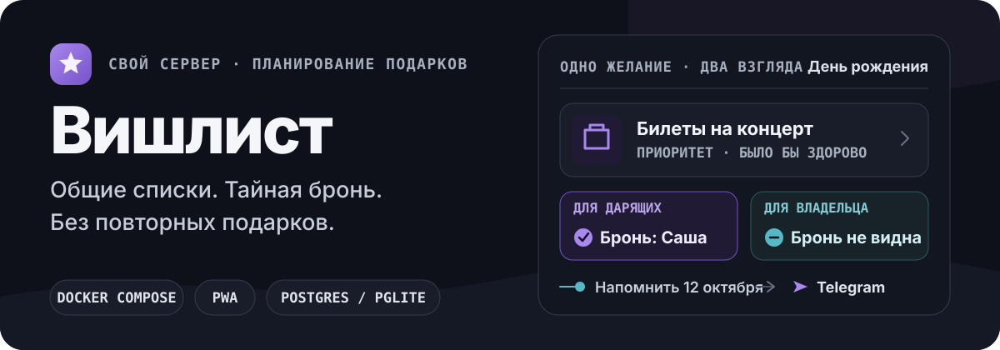

<p align="right">
  <a href="./README.md">English</a>
</p>

<p align="center">
  
</p>

Вишлист — self-hosted веб-приложение для семьи, друзей и небольших команд. Оно собирает идеи, предпочтения, важные даты и подготовку подарков в одном месте — без бесконечного поиска по перепискам.

<p align="center">
  
</p>

## Весь путь подарка в одном месте

- **Сохраняйте идеи** — создавайте личные и общие списки со ссылками, фото, ценами, заметками, категориями и приоритетами.
- **Открывайте подборками** — пока вы не назвали, кому она видна, подборка остаётся вашей: каждый открывает только то, что предназначено ему.
- **Планируйте по людям и датам** — учитывайте предпочтения, дни рождения, личные события, общие праздники и автоматические напоминания.
- **Держите всех в курсе** — отмечайте покупки, обсуждайте изменения, экспортируйте данные и при необходимости подключайте Telegram.

Доступны карточный и табличный виды, поиск, фильтры, сортировка, роли, админ-панель, русский и английский интерфейс и установка как мобильного PWA.

## Выберите подходящий режим

| Режим | Для чего подходит | База данных |
| --- | --- | --- |
| **Docker Compose** | Постоянная домашняя или серверная установка | PostgreSQL в отдельном контейнере |
| **Один контейнер** | Компактная личная установка | Встроенный PGlite в Docker volume |
| **Разработка** | Локальная доработка и тестирование | Локальный PostgreSQL |

Valkey/Redis не обязателен. Без него ограничение частоты запросов работает в памяти процесса приложения.

## Быстрый запуск

Нужны Docker и Docker Compose.

```bash
git clone https://github.com/Superior-Kqller/wishlist-app.git
cd wishlist-app
cp .env.example .env
openssl rand -base64 32
```

Задайте в `.env` надёжные значения `DB_PASSWORD`, `NEXTAUTH_SECRET` и `NEXTAUTH_URL`, затем запустите вариант с PostgreSQL:

```bash
docker network create proxy
docker compose -f docker-compose.prod.yml pull
docker compose -f docker-compose.prod.yml up -d
```

Откройте `http://127.0.0.1:4030`.

Для установки в одном контейнере с PGlite:

```bash
docker compose -f docker-compose.pglite.yml pull
docker compose -f docker-compose.pglite.yml up -d
```

В режиме PGlite переменная `DB_PASSWORD` не нужна, а файлы базы хранятся в Docker volume `pglite-data`.

Все обязательные и дополнительные настройки — Telegram, reverse proxy, начальные пользователи и Valkey — описаны в [`.env.example`](./.env.example).

<details>
<summary><strong>Подключить общий счётчик Valkey/Redis</strong></summary>

```bash
docker compose \
  -f docker-compose.prod.yml \
  -f docker-compose.valkey.yml \
  up -d
```

</details>

## Напоминания календаря

Production-контейнер сам обрабатывает напоминания: отдельный cron или внешний календарный сервис не нужен. Контрольные точки сохраняются, поэтому повторная обработка не дублирует уведомления.

Администратор выбирает IANA-временную зону в разделе **Администрирование → Напоминания календаря**. Начальное значение — `Europe/Moscow`.

## Эксплуатация

Состояние приложения доступно на `/api/health`, версия — на `/api/version`. Данные PostgreSQL и загруженные изображения хранятся в Docker volumes.

<details>
<summary><strong>Основные Docker-команды</strong></summary>

```bash
docker compose -f docker-compose.prod.yml ps
docker compose -f docker-compose.prod.yml logs -f wishlist-app
docker compose -f docker-compose.prod.yml pull
docker compose -f docker-compose.prod.yml up -d
```

Для PGlite замените `docker-compose.prod.yml` на `docker-compose.pglite.yml`.

</details>

## Локальная разработка

Нужны Node.js 22, npm и PostgreSQL.

```bash
npm ci
cp .env.example .env
npx prisma migrate deploy
npm run db:seed
npm run dev
```

Используйте локальный `DATABASE_URL`, задайте `NEXTAUTH_URL=http://localhost:3000` и добавьте `DISABLE_PWA=1` в `.env`.

Чтобы поднять только локальную базу:

```bash
docker compose -f docker-compose.dev.yml up -d
```

Если нужен локальный Valkey, добавьте `--profile cache` и задайте `REDIS_URL=redis://localhost:6379`.

<details>
<summary><strong>Команды разработки</strong></summary>

| Команда | Что делает |
| --- | --- |
| `npm run dev` | Запускает dev-сервер |
| `npm run build` | Собирает production-версию |
| `npm start` | Запускает собранное приложение |
| `npm run lint` | Запускает ESLint |
| `npm test` | Запускает unit-тесты |
| `npm run test:e2e` | Запускает end-to-end тесты Playwright |
| `npm run db:seed` | Создаёт начальных пользователей |
| `npm run db:studio` | Открывает Prisma Studio |

</details>

## Стек

Next.js · React · TypeScript · Prisma · PostgreSQL / PGlite · NextAuth · Tailwind CSS · Radix UI · Docker Compose · опциональный Valkey/Redis

История изменений — в [CHANGELOG.md](./CHANGELOG.md).

## Лицензия

[MIT](./LICENSE)
